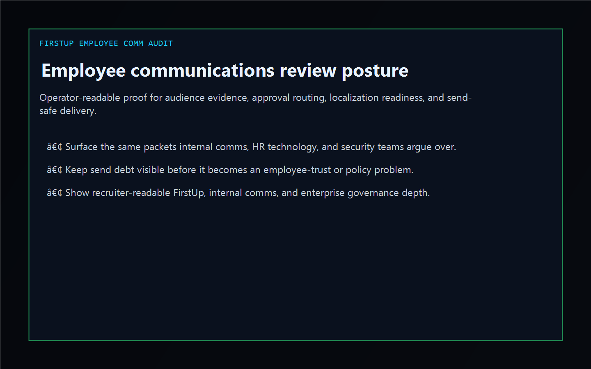
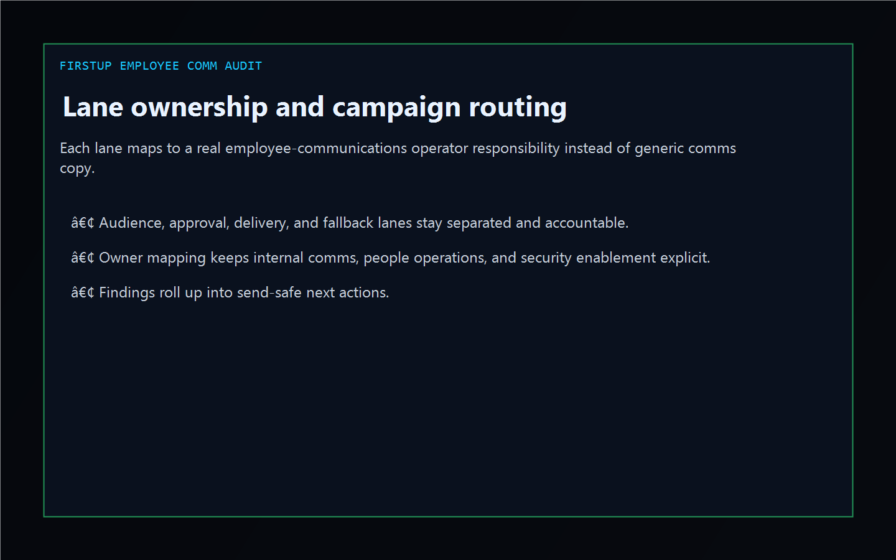
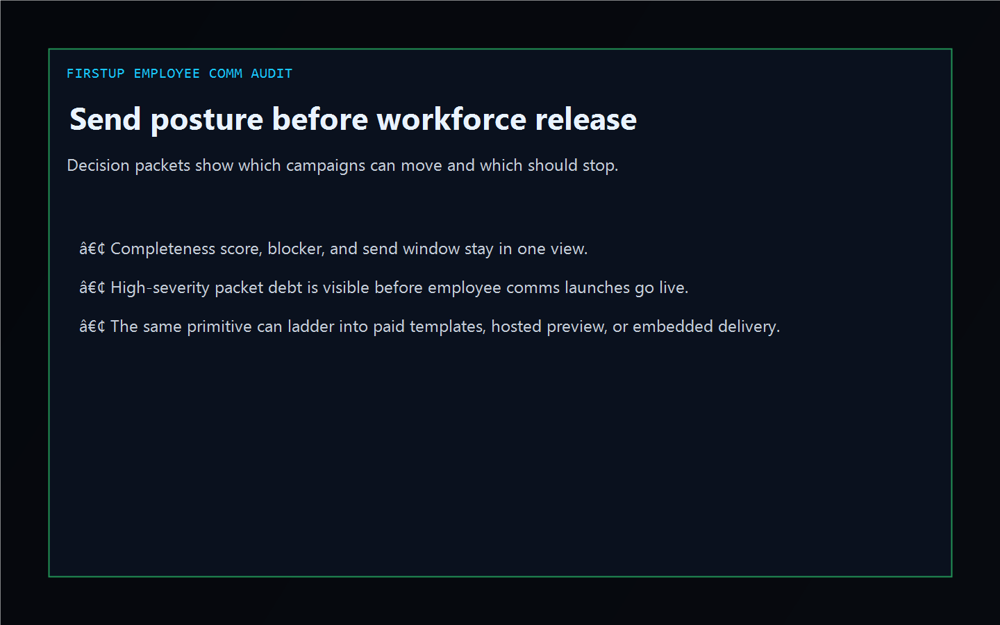

# FirstUp Employee Comm Audit

[](https://github.com/mizcausevic-dev/firstup-employee-comm-audit/actions/workflows/ci.yml)
[](https://github.com/mizcausevic-dev/firstup-employee-comm-audit/actions/workflows/pages.yml)
[](https://github.com/mizcausevic-dev/firstup-employee-comm-audit/releases/tag/v0.1-shipped)

TypeScript control plane for employee communications evidence, audience approval posture, localization readiness, and send-safe delivery sequencing.

Live surface:

- [comms.kineticgain.com](https://comms.kineticgain.com/)

## Why this exists

- Internal comms launches often split audience logic, policy approval, localization review, identity sync, and delivery readiness across HR technology, security, comms, and people-ops teams.
- Enterprise shops still need one operator-readable picture before a sensitive employee campaign, policy change, or executive update goes wide.
- This surface turns synthetic FirstUp-flavored campaign, packet, and review exports into lane, gap, and send posture evidence without pretending to be a live employee comms control plane.

## Why this matters

This repo demonstrates the workforce/internal-comms audit primitive for enterprise buyers: audience evidence tied to missing approvals, stale localization packets, delivery blockers, and send-safe escalation paths. A B2B buyer would care because employee communications posture often needs to surface inside operator tools without exposing live employee records or write-heavy tenant systems. Kinetic Gain Embedded extends this into security-first in-product analytics for review-aware and evidence-aware workflows, see [kineticgain.com/embedded](https://kineticgain.com/embedded).

## Monetization ladder

- Tier 1 now: public repo, dashboard, analyzer, and docs surface
- Tier 2 planned: paid comms approval templates, campaign evidence packs, and send-readiness checklists
- Tier 3 contingent: hosted preview when product rail and billing are ready
- Tier 4 by engagement: embedded employee-comms governance and evidence-routing delivery

## Surface map

- `/`
- `/comms-lane`
- `/message-gaps`
- `/send-posture`
- `/verification`
- `/docs`

Structured APIs:

- `/api/dashboard/summary`
- `/api/comms-lane`
- `/api/message-gaps`
- `/api/send-posture`
- `/api/verification`
- `/api/sample`

## Screenshots





## Local usage

```powershell
git clone https://github.com/mizcausevic-dev/firstup-employee-comm-audit.git
cd firstup-employee-comm-audit
npm install
npm run verify
npm run prerender
npm run render:assets
```

Start the local server:

```powershell
npm run dev
```

Useful routes:

- [http://127.0.0.1:5524/](http://127.0.0.1:5524/)
- [http://127.0.0.1:5524/comms-lane](http://127.0.0.1:5524/comms-lane)
- [http://127.0.0.1:5524/message-gaps](http://127.0.0.1:5524/message-gaps)

CLI example:

```powershell
npx firstup-comm-audit fixtures/firstup-employee-comms-clean.json --format summary
```

## Release discipline

| Guardrail | Posture |
| --- | --- |
| Data handling | Synthetic, non-employee, non-tenant-identifying campaign and packet snapshots only. No live employee or tenant credentials. |
| Deploy | Static prerender -> **https://comms.kineticgain.com/** (GitHub Pages, [pages workflow](./.github/workflows/pages.yml)) |
| SEO | `robots.txt`, `sitemap.xml`, canonical routes, and crawlable docs included |
| Theme | Dark Kinetic Gain operator shell aligned to the current public dashboard standard |
| Tests | `npm run verify` covers lint, typecheck, vitest coverage, build, demo, and smoke |

## Platform note

This is an independent operator-surface demonstration for teams working with employee communications, audience governance, and workforce notification workflows. It is not an official vendor site, SDK, or tenant integration.
